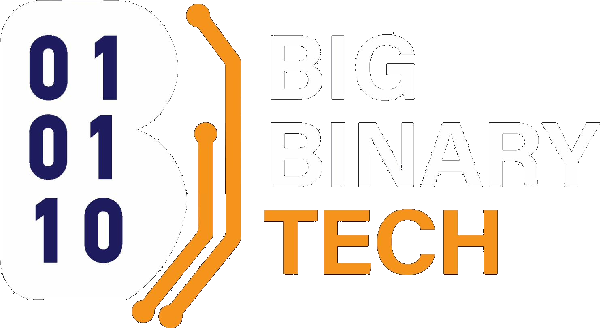

# BBT Design System — Quick Reference
**Big Binary Tech · bbt.edu.pk**

Drop `bbt.css` and `logo.png` into any project folder, copy the snippets below, and you get the full BBT visual identity.

---

## 1. Required `<head>` Block

Paste this into every page's `<head>` (in this order):

```html
<meta charset="UTF-8">
<meta name="viewport" content="width=device-width, initial-scale=1.0">
<title>PAGE TITLE — Big Binary Tech | bbt.edu.pk</title>
<meta name="description" content="PAGE DESCRIPTION">
<link rel="canonical" href="https://bbt.edu.pk/PAGE-SLUG">

<!-- Fonts -->
<link rel="preconnect" href="https://fonts.googleapis.com">
<link rel="preconnect" href="https://fonts.gstatic.com" crossorigin>
<link href="https://fonts.googleapis.com/css2?family=Barlow:ital,wght@0,300;0,400;0,500;0,600;0,700;0,800;0,900;1,400;1,700&family=Barlow+Condensed:wght@600;700;800;900&family=DM+Mono:wght@400;500&display=swap" rel="stylesheet">

<!-- BBT Design System -->
<link rel="stylesheet" href="bbt.css">

<!-- Theme flash prevention — MUST be last in <head> -->
<script>(function(){var t=localStorage.getItem('bbt-theme')||'dark';document.documentElement.setAttribute('data-theme',t)})()</script>
```

---

## 2. Required Scripts (before `</body>`)

```html
<script>
function toggleTheme() {
  var html = document.documentElement;
  var next = html.getAttribute('data-theme') === 'light' ? 'dark' : 'light';
  html.setAttribute('data-theme', next);
  localStorage.setItem('bbt-theme', next);
  var btn = document.getElementById('theme-toggle');
  if (btn) btn.textContent = next === 'light' ? '☀️' : '🌙';
}
window.addEventListener('DOMContentLoaded', function() {
  var t = localStorage.getItem('bbt-theme') || 'dark';
  var btn = document.getElementById('theme-toggle');
  if (btn) btn.textContent = t === 'light' ? '☀️' : '🌙';
  document.body.classList.add('js-ready');
  var io = new IntersectionObserver(function(entries) {
    entries.forEach(function(e) { if (e.isIntersecting) e.target.classList.add('in'); });
  }, { threshold: 0.12 });
  document.querySelectorAll('.reveal').forEach(function(el) { io.observe(el); });
});
</script>
```

---

## 3. NAV (copy to every page — set `.active` on the current link)

```html
<nav>
  <a class="nav-logo" href="/">
    
  </a>
  <div class="nav-links">
    <a href="/">Home</a>
    <a href="/courses">Courses</a>
    <a href="/curriculum">Curriculum</a>
    <a href="/our-approach">Our Approach</a>
    <a href="/franchise">Franchise</a>
    <a href="https://bigbinarytech.com" target="_blank">Software Arm ↗</a>
  </div>
  <button class="theme-toggle" id="theme-toggle" onclick="toggleTheme()" aria-label="Toggle theme">🌙</button>
  <a class="nav-cta" href="/#apply">Apply — April 2026</a>
</nav>
```

> Set `style="color:var(--amber)"` or `class="active"` on the current page's link.  
> Optionally add `<div class="nav-slug">bbt.edu.pk/page-name</div>` inside `.nav-logo` for inner pages.

---

## 4. FOOTER (identical on every page)

```html
<footer>
  <div class="fl">
    
    <div class="fl-s">bbt.edu.pk · Lahore, Pakistan</div>
  </div>
  <div class="flinks">
    <a href="/">Home</a>
    <a href="/courses">Courses</a>
    <a href="/curriculum">Curriculum</a>
    <a href="/our-approach">Our Approach</a>
    <a href="/franchise">Franchise</a>
    <a href="https://bigbinarytech.com" target="_blank">Big Binary Tech ↗</a>
    <a href="/#apply">Apply</a>
  </div>
  <div class="fcopy">© 2026 Big Binary Tech · 0326-0188811 · info@bbt.edu.pk</div>
</footer>
```

---

## 5. Design Tokens (CSS Variables)

All tokens live on `:root` in `bbt.css`. Reference them in any inline style or custom CSS.

### Colors

| Token | Value | Use |
|-------|-------|-----|
| `--dark` | `#0d0d2e` | Page background |
| `--navy` | `#1e1e5c` | Card / section background |
| `--navy3` | `#16164a` | Alternate section BG (trust bar, filter bar) |
| `--amber` | `#f5a623` | Accent, CTA, highlight words |
| `--amber2` | `#e6941a` | Amber hover state |
| `--white` | `#ffffff` | Primary text |
| `--muted` | `rgba(255,255,255,0.55)` | Body copy, secondary text |
| `--faint` | `rgba(255,255,255,0.25)` | Labels, metadata |
| `--border` | `rgba(255,255,255,0.10)` | Dividers, card borders |
| `--border2` | `rgba(255,255,255,0.18)` | Stronger borders, inputs |
| `--card` | `rgba(255,255,255,0.04)` | Card background |
| `--card2` | `rgba(255,255,255,0.07)` | Card hover state |
| `--amber-pale` | `rgba(245,166,35,0.12)` | Badge / tag background |

### Fonts

| Token | Value | Use |
|-------|-------|-----|
| `--barlow` (alias `--b`) | `'Barlow', sans-serif` | Body text, buttons, labels |
| `--condensed` (alias `--bc`) | `'Barlow Condensed', sans-serif` | Headlines, stats, large type |
| `--mono` (alias `--m`) | `'DM Mono', monospace` | Labels, numbers, metadata, URLs |

---

## 6. Typography Classes

```html
<!-- Eyebrow label — amber, mono, all-caps with leading dash -->
<div class="eyebrow">Section Label</div>

<!-- Section heading — condensed, huge, last word/phrase in <em> for amber -->
<h2 class="section-title">BUILT FOR<br><em>THE GAP.</em></h2>

<!-- Page hero heading (h1 only) -->
<h1 class="page-title">TRACK<br><em>TITLE</em></h1>

<!-- Body / lead paragraph -->
<p class="section-body">Supporting copy. Max 440px wide. Light weight.</p>
<p class="hero-lead">Slightly larger version for hero sections.</p>
<p class="page-lead">Inner page variant.</p>
```

### Two-column intro layout (eyebrow + title left, body right)

```html
<div class="two-col reveal">
  <div>
    <div class="eyebrow">Label</div>
    <h2 class="section-title">HEADING<br><em>HERE</em></h2>
  </div>
  <p class="section-body">Supporting body copy on the right side.</p>
</div>
```

---

## 7. Buttons

```html
<!-- Primary — amber filled -->
<a class="btn-primary" href="#">Explore Courses</a>
<!-- alias: btn-p -->

<!-- Outline — white border -->
<a class="btn-outline" href="#">How It Works</a>
<!-- alias: btn-o -->
```

---

## 8. Badges

```html
<span class="badge bf">Highest Demand</span>   <!-- amber -->
<span class="badge bg">Critical Gap</span>      <!-- green -->
<span class="badge bp">Niche · Low Competition</span>  <!-- purple -->
<span class="badge bb">Redesigned</span>        <!-- blue -->
```

---

## 9. Section Wrappers

Every `<section>` gets `padding: 100px 60px` and a bottom border automatically. Use `id=""` for anchor links.

```html
<section id="pipeline">
  <!-- content -->
</section>

<!-- Dark navy background variant -->
<section class="nums-section">  <!-- also: ecosystem-section, mission-section -->

<!-- Reduced top padding (for courses content) -->
<section class="courses-section">
```

---

## 10. Page Hero (inner pages)

```html
<section class="page-hero">  <!-- or just a div -->
  <div class="eyebrow">Section · bbt.edu.pk/slug</div>
  <h1 class="page-title">PAGE<br><em>TITLE</em></h1>
  <p class="page-lead">One or two lines of context.</p>
</section>
```

---

## 11. Marquee Ticker (amber band)

```html
<div class="marquee-wrap">
  <div class="marquee-track">
    <span class="marquee-item">Generative AI</span><span class="marquee-sep">·</span>
    <span class="marquee-item">Cloud + MLOps</span><span class="marquee-sep">·</span>
    <span class="marquee-item">Odoo ERP Dev</span><span class="marquee-sep">·</span>
    <!-- duplicate items to fill the scroll loop -->
  </div>
</div>
```

---

## 12. Trust / Stats Bar

```html
<div class="trust-bar reveal">  <!-- alias: .trust -->
  <div class="ti">
    <div class="ti-num">10<span>:1</span></div>
    <div class="ti-label">Demand-to-supply gap for AI engineers</div>
  </div>
  <div class="tdiv"></div>
  <div class="ti">
    <div class="ti-num">7</div>
    <div class="ti-label">Course tracks built on market gaps</div>
  </div>
  <!-- more .ti + .tdiv pairs... -->
</div>
```

---

## 13. Pipeline / Stages Grid (4 columns, last card amber)

```html
<div class="pipe-grid">  <!-- alias: .stages-grid -->
  <div class="pstg">    <!-- alias: .stg -->
    <div class="pstg-ghost">01</div>
    <span class="pstg-num">Stage 01</span>
    <div class="pstg-n">Trainee</div>
    <div class="pstg-d">Description text here.</div>
    <span class="pstg-dur">Duration: 8–16 weeks</span>
    <div class="pstg-earn">Course Fee · PKR 55–75K</div>
  </div>
  <!-- repeat for stages 02, 03, 04 — last one auto-turns amber -->
</div>
```

---

## 14. Course Cards Grid

```html
<div class="courses-grid">

  <!-- Span-2 featured card -->
  <a class="cc s2" href="/curriculum#track" data-f="ai money">
    <div class="cc-body">
      <div class="cc-top">
        <span class="cc-num">Track 01 · Flagship</span>
        <span class="badge bf">Highest Demand</span>
      </div>
      <div class="cc-title">Generative AI + Agentic AI</div>
      <div class="cc-market">10:1 demand-to-supply gap.</div>
      <div class="cc-desc">Full description here. Keep under 2 lines.</div>
      <div class="cc-pills">
        <span class="cc-pill">Python</span>
        <span class="cc-pill">LangChain</span>
      </div>
      <div class="cc-bottom">
        <div>
          <div class="cc-dur">14 weeks · Advanced</div>
          <div class="cc-outcome">Leads to: <strong>AI Expert at Big Binary Tech</strong></div>
        </div>
        <span class="cc-arrow">Explore →</span>
      </div>
    </div>
    <!-- optional pipeline path row -->
    <div class="cc-path">
      <div class="pdot" style="background:rgba(255,255,255,0.2)"></div>
      <span class="plbl">Trainee</span><span class="parr">→</span>
      <div class="pdot" style="background:#a855f7"></div>
      <span class="plbl">Internee</span><span class="parr">→</span>
      <div class="pdot" style="background:var(--amber)"></div>
      <span class="plbl">Expert</span>
    </div>
  </a>

  <!-- Standard card (1 column) -->
  <a class="cc" href="#" data-f="build">
    <!-- same structure, no s2/s3 class -->
  </a>

</div>
```

> `data-f` values for filter tabs: `ai` `build` `money` `creative` `fast` (space-separated for multiple)

---

## 15. Filter Tab Bar

```html
<div class="filter-bar">
  <span class="filter-label">Filter:</span>
  <button class="ftab active" data-f="all">All Tracks</button>
  <button class="ftab" data-f="ai">AI & Cloud</button>
  <button class="ftab" data-f="build">Software Dev</button>
  <button class="ftab" data-f="money">Highest Earning</button>
</div>
```

Add the filter script at the bottom (inside `<script>`):

```js
const tabs = document.querySelectorAll('.ftab');
const cards = document.querySelectorAll('.cc');
tabs.forEach(tab => {
  tab.addEventListener('click', () => {
    tabs.forEach(t => t.classList.remove('active'));
    tab.classList.add('active');
    const f = tab.dataset.f;
    cards.forEach(card => {
      if (f === 'all') {
        card.classList.remove('hidden');
        if (card.classList.contains('s2')) card.style.gridColumn = 'span 2';
        if (card.classList.contains('s3')) card.style.gridColumn = 'span 3';
      } else {
        const types = (card.dataset.f || '').split(' ');
        if (types.includes(f)) {
          card.classList.remove('hidden');
          card.style.gridColumn = '';
          if (card.classList.contains('s2')) card.style.gridColumn = 'span 2';
          if (card.classList.contains('s3')) card.style.gridColumn = 'span 3';
        } else {
          card.classList.add('hidden');
          card.style.gridColumn = '';
        }
      }
    });
  });
});
```

---

## 16. Earnings / Numbers Grid (3 columns)

```html
<div class="nums-grid">  <!-- alias: .earn-grid -->

  <div class="nc">  <!-- alias: .ec -->
    <div class="nc-stage">
      <div class="ndot" style="background:#a855f7"></div>
      Stage 02 · Internee
    </div>
    <div class="nc-amount" style="color:#a855f7">PKR 20K</div>
    <div class="nc-unit">per month · stipend</div>
    <div class="nc-desc">Description of this earning stage.</div>
    <div class="nc-note">Optional footnote</div>
  </div>

  <!-- Last card highlighted amber: add class "amber" to .nc or "hl" to .ec -->
  <div class="nc amber">
    <div class="nc-amount">You Decide.</div>
  </div>

</div>
```

**Stage dot colors:** `rgba(255,255,255,.2)` → Stage 1 · `#a855f7` → Stage 2 · `#60a5fa` → Stage 3 · `var(--amber)` → Expert

---

## 17. Two-Entity Ecosystem Grid

```html
<div class="eco-grid">
  <div class="eco-cell">
    <div class="eco-num">01 — Education Arm</div>
    <div class="eco-name">BBT Education</div>
    <span class="eco-url">bbt.edu.pk</span>
    <div class="eco-desc">Description.</div>
    <span class="eco-tag">Education Arm</span>
  </div>
  <div class="eco-cell amber-cell">
    <!-- amber-cell auto-inverts all colors -->
    <div class="eco-num">02 — Software Arm</div>
    <div class="eco-name">Big Binary Tech</div>
    <span class="eco-url">bigbinarytech.com</span>
    <div class="eco-desc">Description.</div>
    <span class="eco-tag">Software Arm</span>
  </div>
</div>
<!-- Optional footer bar below the grid -->
<div class="eco-footer">
  <p>Supporting text here.</p>
  <a class="btn-primary" href="#">CTA Button</a>
</div>
```

---

## 18. Why Grid (3-column feature list, last card amber)

```html
<div class="why-grid">
  <div class="wc">
    <span class="wc-n">01 — Label</span>
    <div class="wc-t">Card Title</div>
    <div class="wc-d">Description text, max 2–3 lines.</div>
  </div>
  <!-- repeat... last .wc auto-becomes amber CTA card -->
  <div class="wc">
    <span class="wc-n">— Apply Now</span>
    <div class="wc-t">April 2026. 30 Seats.</div>
    <div class="wc-d">CTA copy here.</div>
  </div>
</div>
```

---

## 19. CTA / Apply Section

```html
<section class="cta-section" id="apply">
  <div class="cta-box reveal">
    <div>
      <h2 class="cta-headline">START YOUR<br><em>TRACK</em><br>TODAY.</h2>
      <p class="cta-sub">Don't just graduate. Get hired — or join us.</p>
    </div>
    <div>
      <div class="cta-form">
        <input class="cta-input" type="email" placeholder="Your email address">
        <button class="cta-submit">APPLY NOW</button>
      </div>
      <p class="cta-note">Or WhatsApp: 0326-0188811 · info@bbt.edu.pk</p>
      <div class="cta-meta">
        <div class="cmi"><div class="cmi-l">Next cohort</div><div class="cmi-v">April 2026</div></div>
        <div class="cmi"><div class="cmi-l">Seats / track</div><div class="cmi-v">30</div></div>
        <div class="cmi"><div class="cmi-l">Tracks</div><div class="cmi-v">7</div></div>
      </div>
    </div>
  </div>
</section>
```

---

## 20. Mission Quote Band

```html
<section class="mission-section">
  <div class="mission-glow"></div>
  <blockquote class="mission-quote reveal">
    THE GOAL IS NOT TO PLACE STUDENTS SOMEWHERE.<br>
    <em>THE GOAL IS TO BUILD PROFESSIONALS WHO CAN GO ANYWHERE.</em>
  </blockquote>
  <div class="mission-attr reveal">Big Binary Tech · Lahore · bbt.edu.pk</div>
</section>
```

---

## 21. Scroll Reveal

Add `class="reveal"` to any element you want to fade-in on scroll. The JS in section 2 handles it automatically. Works on any element.

```html
<div class="reveal">Fades in when scrolled into view.</div>
<section class="my-section">
  <div class="two-col reveal"> ... </div>
  <div class="courses-grid reveal"> ... </div>
</section>
```

---

## 22. Full Page Shell

```html
<!DOCTYPE html>
<html lang="en">
<head>
  <meta charset="UTF-8">
  <meta name="viewport" content="width=device-width, initial-scale=1.0">
  <title>PAGE TITLE — Big Binary Tech | bbt.edu.pk</title>
  <meta name="description" content="PAGE DESCRIPTION">
  <link rel="canonical" href="https://bbt.edu.pk/PAGE-SLUG">
  <link rel="preconnect" href="https://fonts.googleapis.com">
  <link rel="preconnect" href="https://fonts.gstatic.com" crossorigin>
  <link href="https://fonts.googleapis.com/css2?family=Barlow:ital,wght@0,300;0,400;0,500;0,600;0,700;0,800;0,900;1,400;1,700&family=Barlow+Condensed:wght@600;700;800;900&family=DM+Mono:wght@400;500&display=swap" rel="stylesheet">
  <link rel="stylesheet" href="bbt.css">
  <script>(function(){var t=localStorage.getItem('bbt-theme')||'dark';document.documentElement.setAttribute('data-theme',t)})()</script>
</head>
<body>

<nav>
  <a class="nav-logo" href="/"></a>
  <div class="nav-links">
    <a href="/">Home</a>
    <a href="/courses">Courses</a>
    <a href="/curriculum">Curriculum</a>
    <a href="/our-approach">Our Approach</a>
    <a href="/franchise">Franchise</a>
    <a href="https://bigbinarytech.com" target="_blank">Software Arm ↗</a>
  </div>
  <button class="theme-toggle" id="theme-toggle" onclick="toggleTheme()">🌙</button>
  <a class="nav-cta" href="/#apply">Apply — April 2026</a>
</nav>

<!-- ══ YOUR PAGE CONTENT HERE ══ -->

<section class="page-hero">
  <div class="eyebrow">Section Label</div>
  <h1 class="page-title">PAGE<br><em>TITLE</em></h1>
  <p class="page-lead">Supporting description, one or two lines.</p>
</section>

<section>
  <div class="two-col reveal">
    <div>
      <div class="eyebrow">Label</div>
      <h2 class="section-title">HEADING<br><em>HERE</em></h2>
    </div>
    <p class="section-body">Body copy.</p>
  </div>
</section>

<section class="cta-section" id="apply">
  <div class="cta-box reveal">
    <div>
      <h2 class="cta-headline">START YOUR<br><em>TRACK</em><br>TODAY.</h2>
      <p class="cta-sub">Don't just graduate. Get hired — or join us.</p>
    </div>
    <div>
      <div class="cta-form">
        <input class="cta-input" type="email" placeholder="Your email address">
        <button class="cta-submit">APPLY NOW</button>
      </div>
      <p class="cta-note">WhatsApp: 0326-0188811 · info@bbt.edu.pk</p>
    </div>
  </div>
</section>

<!-- ══ END PAGE CONTENT ══ -->

<footer>
  <div class="fl">
    
    <div class="fl-s">bbt.edu.pk · Lahore, Pakistan</div>
  </div>
  <div class="flinks">
    <a href="/">Home</a><a href="/courses">Courses</a>
    <a href="/curriculum">Curriculum</a><a href="/our-approach">Our Approach</a>
    <a href="/franchise">Franchise</a>
    <a href="https://bigbinarytech.com" target="_blank">Big Binary Tech ↗</a>
    <a href="/#apply">Apply</a>
  </div>
  <div class="fcopy">© 2026 Big Binary Tech · 0326-0188811 · info@bbt.edu.pk</div>
</footer>

<script>
function toggleTheme() {
  var html = document.documentElement;
  var next = html.getAttribute('data-theme') === 'light' ? 'dark' : 'light';
  html.setAttribute('data-theme', next);
  localStorage.setItem('bbt-theme', next);
  var btn = document.getElementById('theme-toggle');
  if (btn) btn.textContent = next === 'light' ? '☀️' : '🌙';
}
window.addEventListener('DOMContentLoaded', function() {
  var t = localStorage.getItem('bbt-theme') || 'dark';
  var btn = document.getElementById('theme-toggle');
  if (btn) btn.textContent = t === 'light' ? '☀️' : '🌙';
  document.body.classList.add('js-ready');
  var io = new IntersectionObserver(function(entries) {
    entries.forEach(function(e) { if (e.isIntersecting) e.target.classList.add('in'); });
  }, { threshold: 0.12 });
  document.querySelectorAll('.reveal').forEach(function(el) { io.observe(el); });
});
</script>

</body>
</html>
```

---

## 23. Files Needed in Every Project

| File | Role |
|------|------|
| `bbt.css` | Entire design system — tokens, layout, components, responsive |
| `logo.png` | BBT logo (used in nav + footer) |

That's it. Two files. Everything else is HTML from the snippets above.

---

## 24. Key Rules

- **Always dark background.** Never use a white/light background unless you add the light-mode token overrides from `bbt.css` section 29.
- **Orange (`--amber`) is for highlights only** — key words in headlines, CTAs, stat numbers. Never for body text.
- **Headlines:** Barlow Condensed, `font-weight: 900`, `text-transform: uppercase`. Italic `<em>` = amber.
- **Labels/metadata:** DM Mono, `font-size: 10–11px`, `letter-spacing: 0.1em`, `text-transform: uppercase`.
- **Body copy:** Barlow, `font-weight: 300`, `color: var(--muted)`.
- **Grid gaps:** use `gap: 1px; background: var(--border)` on the grid container — this creates the "border between cells" effect.
- **Last card amber:** In `.why-grid`, `.pipe-grid`, `.stages-grid` — the last child is automatically amber. If you want it as a CTA, put the CTA card last.
- **Scroll reveal:** Add `class="reveal"` to anything. The DOMContentLoaded script handles it.
- **No `<style>` blocks in HTML.** All CSS goes in `bbt.css`.
